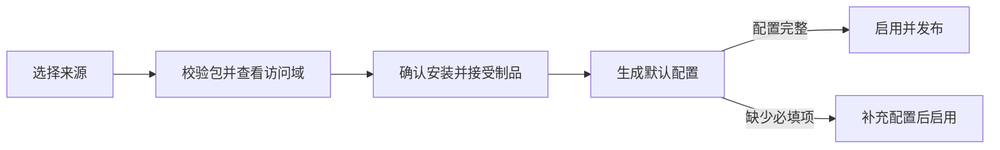

# 插件使用

插件“制品”是按 SHA-256 固定的代码、版本和访问域；“配置”是运行实例，保存普通设置、敏感设置和功能范围。
同一插件可以有多份配置，例如分别用于测试与生产。访问域随制品接受，不能在实例中另行增删。

宿主支持 SDK `0.4.0`、`manifestVersion: 3` 和进程协议 `4`。包必须同时满足当前平台和宿主兼容范围。

## 安装

在“插件管理”点击安装图标，选择来源：

- **上传包**：选择发布者提供的 `tar.gz` 或 `tgz` 包
- **URL**：填写固定下载地址；支持 HTTPS，本机回环地址可使用 HTTP
- **GitHub**：填写仓库地址或 `owner/repo`；标签留空查询最新稳定版，预发行版须指定标签

公开来源无需认证。私有来源可选择或创建独立下载认证；认证按来源和用途限制，不会交给插件进程。
下载代理独立选择，默认直连，代理失败不会回退直连。SHA-256 用于固定内容，不证明发布者身份。

“下一步”只解析和校验包，不保存制品。检查名称、发布者、版本、平台、摘要和访问域后确认安装；上传、URL
和 GitHub 安装会接受该摘要声明的访问域。随宿主发行物导入的官方制品会显示为“待接受”，也必须先查看访问域并确认，
未接受的制品不能创建或编辑配置。相同摘要的确认可安全重试。

确认安装后，若该插件还没有任何配置，宿主会：

1. 从 schema 填入普通配置默认值，不把敏感字段的默认值写入普通配置
2. 为需要实例范围的贡献项生成默认绑定；管理页面和命令行按声明注册，入口认证不自动绑定
3. 配置完整时直接启用并发布；仅缺少必填项时保存为停用并打开配置页

类型错误、非法 schema 或把敏感值混入普通配置会直接拒绝，不会伪装成“待配置”。插件已有任一配置时，安装其他版本
不会再创建默认配置，也不会切换现有配置的版本。

### 五个访问域

安装确认只使用以下稳定访问域；具体调用仍受贡献项、当前调用上下文和宿主策略限制。

| 标识 | 安装摘要中的含义 |
| --- | --- |
| `network` | 访问网络 |
| `models` | 查询模型和 Client Key 基本信息并调用模型，可能产生消耗 |
| `accounts` | 读取和修改账号，包括访问原始凭据 |
| `requests` | 查看和处理请求、响应、路由及账号选择 |
| `public_endpoints` | 提供无需登录即可访问的资源与回调入口 |

访问域不是操作列表或资源白名单。实例配置不能扩大、缩小或伪造制品声明；切换版本后使用目标制品已经接受的精确声明。
插件进程与网关使用相同的系统身份，接受访问域不是操作系统沙箱，因此只安装可信来源的包。

## 配置与启用

1. 填写插件设置；敏感字段与普通配置分开保存，编辑时可保留已有密钥而不读取其值
2. 按需调整功能范围；客户端 Key、账号分组、Provider 和模型等范围同时满足才生效，同一范围内任一值匹配即可
3. 保存为启用或停用；启用前必须补齐必填设置，并通过包、配置、绑定和私有状态检查

范围数组为空表示不限制该维度。自动创建的默认绑定不预先绑定 Client Key；普通网关请求仍以实际请求的 Key 和冻结策略
执行。管理页面和命令行不保存功能 binding，页面调用模型时由页面每次明确选择一个 Client Key ID，宿主按当前 Key 状态、
范围、预算、账本和普通请求链执行，插件看不到 Key 明文。

`frontend_authentication` 不会随安装自动接管入口。启用它时必须明确配置外部 principal 到既有 Client Key 的映射；
已停用或删除的 Key 不会因此恢复访问。需要不同设置或范围时添加配置，不要重复安装同一制品。

“已启用”表示配置已经发布，不是外部服务的健康证明。“等待生效”表示候选仍在准备；“需要处理”会显示发布或运行失败原因。
并发编辑冲突时应重新加载当前 revision 后确认，不能覆盖另一窗口的修改。

## 使用

| 功能 | 使用方式 |
| --- | --- |
| 管理页面 | 从插件详情或左侧插件导航打开；页面在隔离 iframe 中运行 |
| 页面模型请求 | 每次选择 Client Key，经固定实例版本的 Responses 桥执行，返回原生 JSON 或 SSE |
| 请求中间件、模型路由、账号调度、请求观察 | 匹配功能范围的正常网关请求自动使用 |
| Provider 扩展 | 在账号管理中按插件支持的方式添加或授权账号 |
| 入口认证 | 客户端按插件协议访问，宿主把明确的 principal 映射到 Client Key |
| 维护任务 | 宿主按已声明能力和当前访问域调度，不提供没有后端支持的手动入口 |
| 命令行 | 在宿主环境运行 `codex-proxy-rs plugin <配置 ID> --help` |

页面模型桥要求管理会话、当前实例/制品/revision 和 `models` 访问域同时有效。停用实例、切换版本或 revision、
撤销相应访问资格后，宿主会在等待首帧和交付响应期间持续复核并取消请求；它不会把管理 Cookie、Key 明文或认证头交给插件。

## 更新、回滚与卸载

“版本”将检查、安装和切换分开：

- **检查更新**：GitHub 按已保存策略查询发布，手动策略按需查询最新稳定版；URL 下载并解析当前地址的包，按版本和摘要比对；本地上传不支持查询。检查不会安装、接受权限或切换配置，GitHub 标签也不等于包内版本。
- **安装新版本**：复用上传包、URL 和 GitHub 安装入口。带入已保存来源与上次安装信息，当前浏览器标签页还会记住未提交的安装参数和凭据引用，不保存认证明文或文件。修改来源时须显式保存后继续，取消后续安装不会撤销已保存的来源。
- **快速切换**：选择需要切换的配置，沿用设置、密钥、绑定和启停状态。配置不兼容时拒绝切换，可主动进入“调整配置”，按目标版本修改后保存并切换；不会静默移除参数、功能绑定或密钥。

新旧版本可以共存，安装并接受新版本不会自动切换已有配置，多份配置分别确认。私有数据迁移仍由插件声明的迁移能力处理，
不兼容且无迁移路径时不能切换；迁移失败会尝试恢复，若恢复会覆盖并发修改则保持停用，需要管理员处理。

“回滚版本”只列出同一插件已安装且已接受的较早版本，保留当前设置、密钥、绑定和启停状态；访问域随目标制品，且目标仍须通过
配置与私有状态兼容检查，因此不是任意旧版都能回滚。

| 操作 | 删除什么 | 保留什么 |
| --- | --- | --- |
| 停用 | 不删除；新请求不再使用 | 配置、密钥、私有数据和版本 |
| 删除配置 | 该配置及其密钥、私有数据；无法撤销 | 已安装版本 |
| 删除版本 | 所选制品及其已无引用的下载认证；最后一个版本还会清理来源规则；被配置或在途调用引用时不能删除 | 其他版本与配置、共享下载认证 |
| 卸载插件 | 确认范围内的配置、数据、版本、来源规则及已无引用的下载认证 | 其他插件仍使用的下载认证、审计记录 |

卸载不是跨多个请求的事务；失败时会显示已完成结果，可重试剩余步骤，不会扩大到确认后新增的配置。只想暂时停用时不要卸载。
完整卸载后重新安装可选择新的来源，不再沿用旧来源限制。独立创建但未被删除版本使用的下载认证不会被顺带删除。
需要保留数据时，删除前按[部署、备份与恢复](../deploy/README.md)保存备份。

开发插件见 [SDK](../backend/crates/gateway-plugin/sdk/README.md) 与 [插件 CLI](../backend/apps/plugin-cli/README.md)；
完整示例在独立的 `codex-proxy-plugins` 仓库维护。HTTP 字段与限制见 [API 参考](api.md#12-插件管理)。
